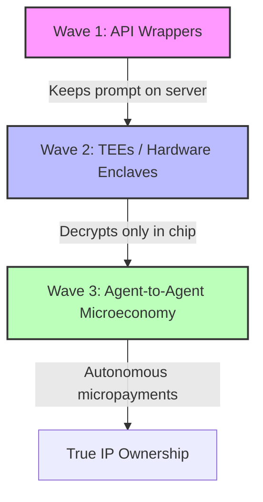

*This essay explores the paradox of the AI creator economy: we are building highly valuable \"agent skills,\" yet packaging them in the most insecure format possible—plain text. We analyze the shift from open markdown files to secure execution loops, and how hardware-enforced cryptography is about to change the rules of ownership.*

In 1996, Bill Gates famously declared that "Content is King." For three decades, that axiom held true—if you controlled the distribution of the content, you controlled the monetization. But in the age of generative AI and autonomous agents, we are witnessing a weird, slightly alarming paradox: **our content is no longer just media; it is executable code.**

Today, we talk a lot about "skills." A skill is essentially an instruction set—a structured markdown file (like `.md` or `.json`) that teaches an AI agent how to perform a specialized task. It could be auditing a complex tax return, translating archaic legal jargon, or negotiating a software license. 

The promise is beautiful: write a skill once, plug it into an agent, and let it run. It feels like the ultimate democratization of work.

But there is a glaring, underlying problem that the tech-hype crowd is conveniently ignoring: **skills are just text files. And if an AI can read them, so can everyone else.**

Once you distribute a raw markdown skill, you have handed over the keys to the castle. It can be copied, reverse-engineered, or leaked via a simple prompt injection attack in three seconds flat. 

So, how do we monetize something that is inherently un-lockable? Is anyone actually solving this, or are we just handing our intellectual property over on a silver platter?

---

## Part 1: What’s Broken? (The Open-Text Trap)

Imagine running a high-end restaurant where, in order for the chef to cook a meal, they have to shout the exact secret recipe out loud to the entire dining room. That is the current state of local AI agent skills.

To understand why this is broken, let’s look at the anatomy of a typical "skill." In standard agent architectures (including frameworks like LangChain, Autogen, or even modern ideation environments), a skill is a system prompt paired with some tools. It relies on plain English to direct the model’s reasoning.

This open-text approach creates three massive speed breakers for anyone trying to build a business around AI expertise:

### 1. Zero Copy Protection
Unlike traditional compiled software (where reverse-engineering binary code is incredibly difficult), an AI skill is written in human language. There is no "compilation step." If a user purchases your skill and downloads it to run locally, they have the source code. They can modify it, package it, and resell it under their own brand by lunchtime.

### 2. The Prompt Injection Vulnerability
Even if you host the skill on a server and only let users interact with it via a chat box, the model itself remains a liability. Security researchers have proven time and again that with a clever bit of psychological manipulation—what we call "jailbreaking"—a user can convince an LLM to ignore its system boundaries and spit out its entire underlying prompt.

### 3. Misaligned Incentives
In the Web2 world, platforms like YouTube or Spotify captured the lion’s share of the value because they owned the distribution network. In the raw AI world, the model providers (OpenAI, Anthropic, Google) capture the value. If your high-value skill is just a wrapper around their API, you are taking all the creative risk while they reap the compute revenue. 

> The way incentives are currently structured, the creators of the "intelligence" (the prompt designers) are doing the heavy lifting, while the execution layer captures the economics. 

*(PS: This is not to downplay the incredible engineering that goes into building foundational models, but rather to point out the asymmetry in who actually gets paid).*

---

## Part 2: The Three Waves of Protection

Technology evolution always follows a predictable path: first comes the wild west of free play, and then comes the infrastructure that makes commerce viable. We are currently transitioning between three distinct waves of how to lock down and monetize agentic skills.

### Wave 1: The API Wrapper (Traditional SaaS)
The immediate, low-hanging fruit solution is simple: **never ship the file.** 

Instead of letting a user download your `.md` skill, you host it on your own secure backend. You expose a simple API endpoint (or a tool schema). When the user's agent needs your skill, it sends the raw data to your server. Your server runs the LLM call secretly behind a firewall and returns only the clean output.

Platforms like **Agent.ai** and **Coze** are capitalizing on this model. They allow you to build and monetize agents where the complex prompt workflows are kept entirely out of reach of the end-user. 

But this still doesn't solve the "jailbreak" problem, and it forces creators to run expensive hosting infrastructure. 

### Wave 2: Hardware-Enforced Privacy (Trusted Execution Environments)
This is where the intersection of cryptography and hardware gets incredibly interesting. 

Instead of relying on firewalls, we can use **Trusted Execution Environments (TEEs)**—often called "secure enclaves." This is hardware-level isolation provided by chipmakers like Intel, AMD, and NVIDIA.

* You package your markdown skill in an encrypted container.
* When the agent executes, the skill is sent to a TEE on a remote cloud server (like AWS Nitro or Azure Confidential Computing).
* The skill is decrypted **only inside the processor's silicon memory**. 
* Even the cloud host or the server administrator cannot read the text.
* The processor runs the inference and returns a cryptographic "attestation" proving that the code was run securely without ever exposing the text.

Projects like **Phala Network** are building "AI Agent Contracts" on top of TEEs specifically for this. It allows developers to deploy secret, monetizable agent logic that runs autonomously in a secure bubble.

### Wave 3: The Agent-to-Agent (A2A) Micropayment Economy
In a fully mature AI ecosystem, the ultimate end-state is that we stop selling to humans altogether. **Agents will hire other agents.**

If my local developer agent needs to audit a smart contract, it shouldn't download a "solidity-auditor.md" skill. Instead, it should search a decentralized registry, find a highly rated specialist Auditor Agent, negotiate a rate, and pay it 0.001 cents via a lightning-fast micropayment (using rails like Skyfire, Autonolas, or Circle’s programmable wallets).

Your skill is never exposed. The value is captured purely through execution, and the incentives are perfectly aligned:

| Model | Where the Skill Lives | Risk of Theft | Revenue Model |
| :--- | :--- | :--- | :--- |
| **Open-Text (.md)** | Local Disk | **Critical** (100%) | One-time donation / Free |
| **API Wrapper** | Secure Cloud | **Medium** (Jailbreaks) | Subscription / SaaS |
| **TEE Enclave** | Encrypted Silicon | **Zero** | Pay-per-execution |

---

## Part 3: The Path Forward

Web3 and cryptography are often dismissed as solutions in search of a problem. But when it comes to AI agents, they represent the only logical framework to enforce digital scarcity. 

If we want a future where independent domain experts can make a living by encoding their unique knowledge into AI skills, we have to move past the naive idea that "everything should be open-text." 

We need to start treating prompt engineering not as writing "good search queries," but as compiling proprietary software. 

The transition from open markdown files to encrypted, enclave-run execution loops isn't a speed breaker for innovation—it is the very catalyst that will make the AI creator economy sustainable. 

*What are your thoughts on this? Are you keeping your prompts open, or are you looking at ways to wrap them in secure enclaves? Drop a comment or let me know on Twitter [@pranaym23](https://twitter.com/pranaym23) to continue the conversation.*

---

*Originally published on pranaym.com. If you enjoyed this piece, feel free to share it with other builders in the space.*
